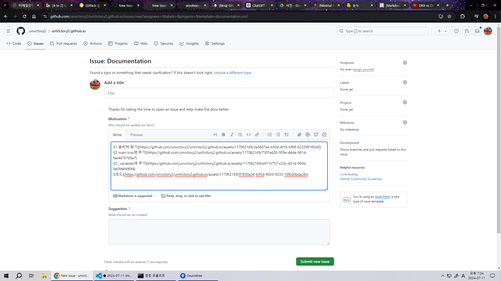

# 2일차

## 순서
1. 일정
2. Flutter 설치 과정
3. 초기 화면 알아보기
4. Dart의 변수와 자료형
5. Dart의 수식과 연산자
6. 용어, 문제 해결

---

## 일정

- 7.24 ~ 8.21 프로젝트
- 8.19 ~ 8.20 제주도 워크숍, 참여 시 8.20 발표
- 8.20 수강신청
- 9.2 개강

### 수업 계획
- **1주차**: Dart
- **2주차**: Flutter
- **3주차**: 복잡적인 기술들 (백엔드 연결, java 등)
- 1주차 끝나고 노트북 대여 여부 결정

---

## Flutter 설치 과정

#### 1. VSC에서 Flutter Extention을 추가 (아직 Flutter를 깐 것은 아님, Extention 추가했을 뿐)
   - `Shift + Ctrl + P` > `flutter new`까지 치고 `flutter new projects` 엔터
   - Download SDK 하고 이후 뜨는 팝업에서 환경 변수 더하기까지 누르면 완료. 
     
   - 아니면 locate SDK 하고 이미 받아서 압축 풀어둔 flutter 폴더 지정. 못 찾겠다 하면 폴더 위치를 압축 푼 폴더 내부의 `bin`으로.
   - 예시: `C:\Users\seung\Desktop\공부\flutter_windows_3.22.2-stable\flutter\bin`
   - 하지만 이 방법을 쓰면 직접 환경 변수의 PATH에 이 경로를 똑같이 추가해줘야 함.
  
#### 1-1. 다른 방법: 안드로이드 스튜디오에서 플러그인 설치
   - Flutter 플러그인 설치
   - 환경변수 설정. `Path`에 Flutter 경로 추가
   - CMD에서 `flutter` 쳐서 설치 확인
  

#### 2. 안드로이드 스튜디오에서
   - `Tools` > `SDK Manager` > `SDK Tools` > `Android SDK Command Line Tool` 다운로드 (파일 > 설정에서도 찾을 수 있다)
   - Android SDK Builds도 다운로드
     
     
<br>
#### 3. VSC에서 로그 열고 Dart 입력 후 제대로 뜨나 확인

<br>
#### 4. CMD에서 Flutter 프로젝트 할 경로까지 가서 `dart create exam01`
   - PowerShell에선 안 될 수도 있다
   - 프로젝트 exam01 만듦

#### 5. 안 되면 조교님께 연락 후 교수님께 문의
   - 임시방편: 크롬에서 [dartpad.dev](https://dartpad.dev)로 임시로 사용

#### 6. `flutter doctor`를 CMD에서 쳐서 설치 확인 가능
   - 모든 사항 초록 체크 뜨는지 

#### 7. VSC에서 프로젝트 경로 설정

---

## 초기 화면 알아보기

#### bin과 lib

lib의 myutil.dart에서
```dart
int calculate() {
  return 6 * 7;
}
```
를 정의하고,
bin의 exam01.dart에서
```dart
import 'package:exam01/myutil.dart' as exam01;

void main(List<String> arguments) {
  print('Hello world: ${exam01.calculate()}!');
}
```
이런 식으로 calculate()를 가져와 사용할 수 있다. 이 때 모듈명, 즉 bin이나 lib의 exam01, myutil은 모두 소문자로 써줘야 한다.

#### import문 살펴보기
위 내용과 이어진다.

`import 'package:` 까지는 필수고, 기본 경로가 lib폴더로 돼있기 때문에 라이브러리를 사용할 거면 이후 라이브러리 명을 치면 된다. 
`\myutil.dart' as exam01;` 로 myutil.dart를 가져오고, 코드에선 exam01이라는 별명으로 쓸 수도 있다.

함수가 여러 개인 경우 특정 함수만 가져올 수도 있다. 메모리를 절약하는 방법.

```dart
import 'package:exam01/myutil.dart' show calculate;
```
함수가 유일한 경우 앞의 코드에서 사용시 앞의 exam01을 생략할 수도 있다.
```dart
print( 'Hello world: ${exam01.caculate()}!' ); // 유일하지 않은 경우
print( 'Hello world : ${calculate()}!'); // 유일한 경우
```

#### main 함수의 원형
원래 main은 
```dart
void main(List<String> arguments) {} 
```
다. 인자 `List<String> arguments`는 생략 가능하다. 실행파일이 커멘드 라인을 통해서 받을 수 있는 옵션이 문자열로 들어오는데, 그게 받는 게 저 인자의 역할이다. 명령어들이 String 형식으로 들어오기 때문에 String 타입의 제네릭으로 설정돼있다.

#### $의 역할
```dart
print( 'Hello world: ${exam01.caculate()}!' );
```
에서 `$`는 변수 혹은 함수의 결과값 출력할 거라는 뜻이다. 문자열 보간 표현 방식이라고 부른다.
변수 하나만 쓸 거면 이후 중괄호를 넣지 않아도 되지만 아닐 때는 {}로 감싸줘야 한다.

---

## Dart의 변수와 자료형

#### 기본적인 데이터 타입
```dart
int num;
String str;
double d;
bool ok;
```
이들은 모두 변수가 아니라 객체다.

#### var
```dart
//타입 추론
var num1 = 10;
var str = 'Dart';
```
var가 붙은 데이터들은 컴파일 할 때 데이터 타입이 결정된다. num1은 정수형 변수가 아니지만, 10을 넣는 순간 정수형 변수가 된다고 생각하면 편하다.
데이터 타입이 애매할 때 var를 써서 유연하게 데이터 타입을 쓰는 건 Dart의 **가장 큰 특징 중 하나**다.

#### 상수
```dart
final d1 = 100;
const int d2 = 100;
```
final과 const 둘 다 값 변경이 불가능하다는 특징이 있다. 그러나 final은 값을 처음에 유보하고 나중에 값을 줄 수 있으나 const는 처음부터 값을 무조건 줘야 한다는 차이점이 있다.

---

## Dart의 수식과 연산자

#### 사칙연산
```dart
print ("num1 + num2 = ${num1 + num2}");
print('num1 += num2 = ${num1 += num2}');
print ("num1 - num2 = ${num1 - num2}");
print ("num1 * num2 = ${num1 * num2}");
print ("num1 / num2 = ${num1 / num2}"); //나누기는 결과가 double = 실수임. 5/3 = 1.xx
print ("num1 ~/ num2 = ${num1 ~/ num2}"); //이건 몫만 구함. 5/3 = 1
print ("num1 % num2 = ${num1 % num2}"); //나머지. 5/3 = 2
```
나머지는 별 특징이 없으나 `/, ~/` 이 둘은 차이가 있다. `/`는 실수 결과물을 주고, `~/`는 정수 결과물을 준다.

#### prefix, postfix
```dart
print("num1++ = ${num1++}");
print("num1-- = ${num1--}");
print("++num1 = ${++num1}"); //prefix
print("--num1 = ${--num1}"); //postfix
```

#### shift 연산
```dart
var result = num1 >> 2;
print('num1 >> 2 = $result');

//부호비트 무시하고 무조건 0으로 채움
result = num1 >>> 2;
print('num1 >>> 2 = $result');

```
shift 연산, 즉 비트연산도 지원한다. `<<`로 왼쪽 시프트, `>>`로 오른쪽 시프트. 

왼쪽으로 밀어서 오른쪽 비트 하나가 없어지면 이건 그냥 0으로 채운다.
오른쪽으로 밀면 왼쪽 비트 하나가 없어진다. 그러나 이건 부호 비트다. 고로 `>>`에서 부호 비트는 고정하고, 그 다음 칸을 0으로 채운다.
**하지만 `>>>`의 경우엔 부호 비트도 일반 비트로 취급하고 밀어버린다.**

참고 : 1바이트 = 8비트 = signed = -128~127, unsigned = 0~255

#### 비트 연산자
```dart
result = num1 & num2; // bit and. tt만 t
result = num1 | num2; // bit or. ff만 f
result = num1 ^ num2; // bit xor. tt, ff는 f. 다르면 t
result = ~num1; // bit not. 결과 반전
```

#### 관계(비교)연산자
```dart
var b = num1 == num2;
b = num1 != num2; // != < > <= <= 전부 있다.
```
**`==`도 output이 있음.** `num1==num2`의 결과가 `b`에 들어간다는 뜻이다. true나 false
논리 연산자는 결과가 논리값이지만,
비트 연산자는 값을 가지고 비트끼리 연산하기에 결과가 숫자임.
```dart
b = num1 is int; 
b = num1 is! int; 
```
런타임 타입 체크. 컴파일(코딩)타임 말고, 실행시켰을 때 num1의 데이터 타입이 int인지 확인.
**`num1`이 int면 `b`는 true, 아니면 false.**
`is!`의 경우엔 int가 아니면 `true`, 반대는 `false`.

#### 삼항연산자
```dart
result = (num1 > num2) ? num1 : num2; 
```
참이면 result는 num1, 아니면 num2

#### ??이 들어간 대입 연산자
```dart
int? num3; //nullable
num3 = null;
num3 ??= 10; //null이면 10
```
nullable 정수 `num3`에 `null`을 넣는다. 
이후 `num3 ??= 10;`의 의미는, num3가 null이라면 10을 넣으라는 뜻이다.

응용해보면,
```dart
String playerName(String? name) => name?? 'Guest';
```
`=>` 란? **=>는 함수 본문이 단 하나의 표현식으로 구성될 때 사용하며, 그 표현식의 결과가 함수의 반환값이 된다.** 람다 함수 정의 방법이라고 보면 될듯.

**함수 `playerName`은 인자로 `name`을 받는다. 이 때 이 `name`이 `null`이라면 `'Guest'`를 넣고, `null`이 아니라면 `name`을 반환한다.**

#### Object와 as, dynamic
```dart
Object myName = 'Dart';
```
myName은 'Dart'가 저장되는 순간 String 타입으로 정해진다.
```dart
String yourName = myName as String; 
```
as는 형변환이라고 볼 수 있으나, 같은 클래스 계보 내에서만 가능하다. (공통 조상을 가진 경우만)

```dart
dynamic myName2 = 'Dart';
```
잘 안 쓴다. 아무거나 다 넣을 수 있어서. 뭘로든 형변환 가능하기에 권장하지 않는다.
```dart
myName2 = 10; 
```
바로 이렇게 정수 넣어버릴 수도 있다.

---

## 용어, 문제 해결

#### 하이라이팅 문제
노트북에선 이런 식으로

하이라이팅이 안 되는 건 아닌데, 색이 굉장히 단조롭고 흰 색으로 남는 부분이 많았다.

그에 비해 데스크탑에선

이런 식으로 다채로운 하이라이팅이 됐다.

**해결방법:** 테마 문제였다. 
`Ctrl + K`를 누르고 `Ctrl + T`를 눌러 테마 선택 창을 연다.
노트북 VSC의 테마를 데스크탑의 VSC 테마와 동일한 테마로 바꿔 준다. Dark Modern 테마로 바꾸니 해결.

---